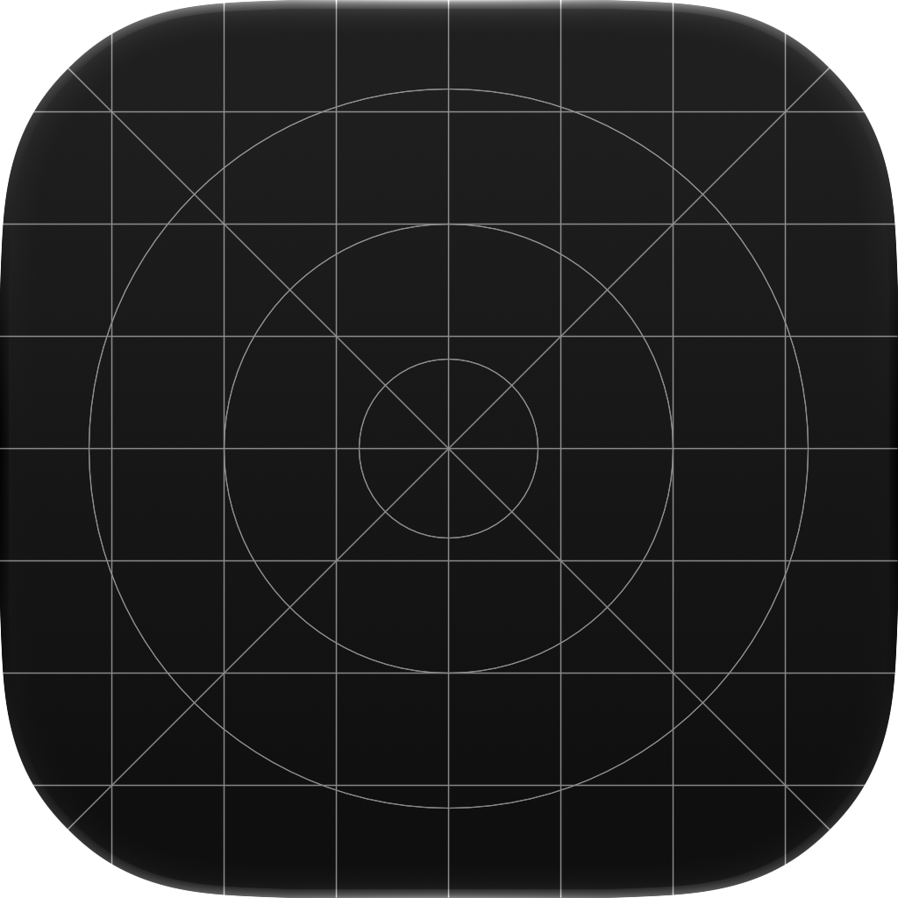
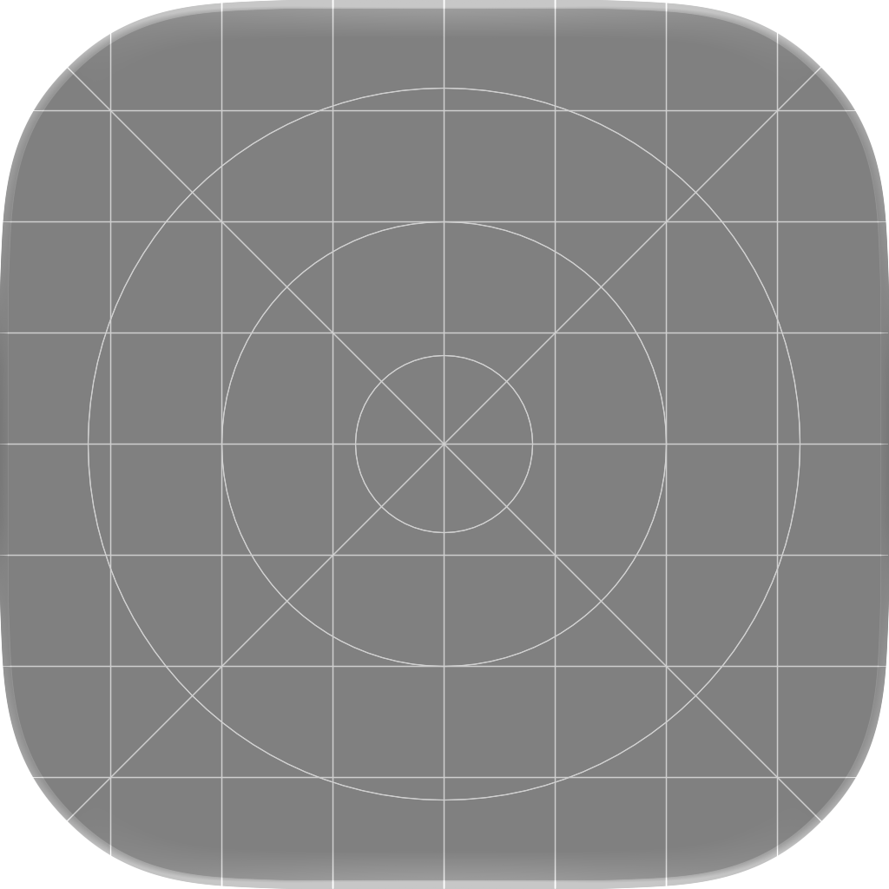
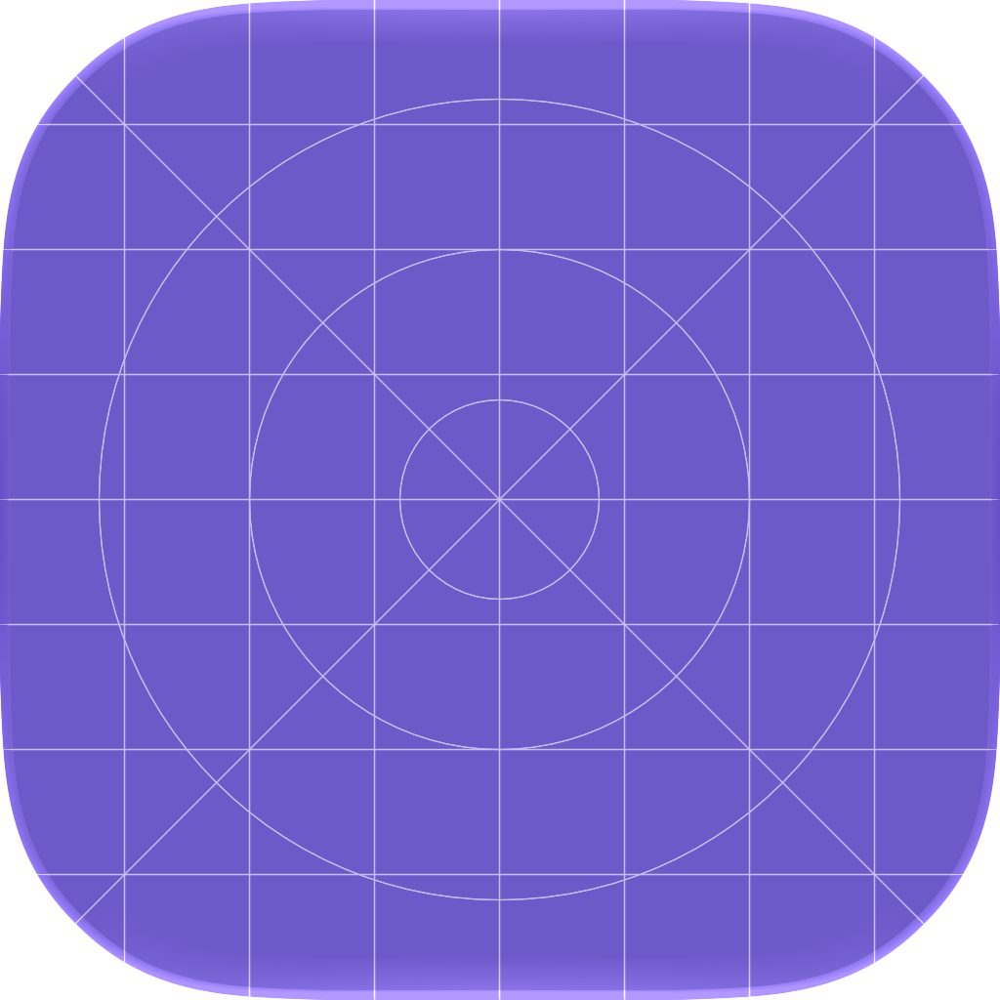
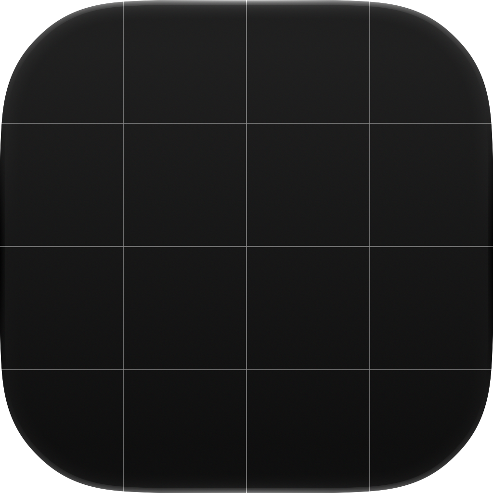
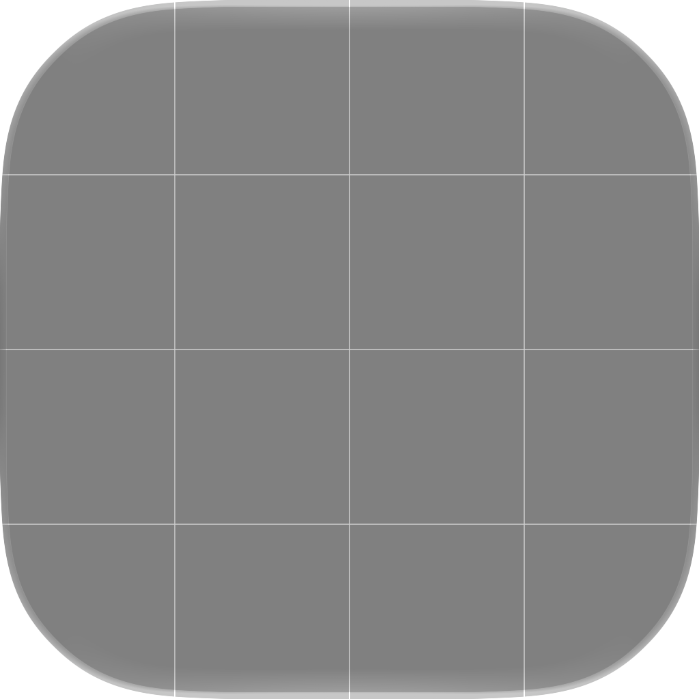
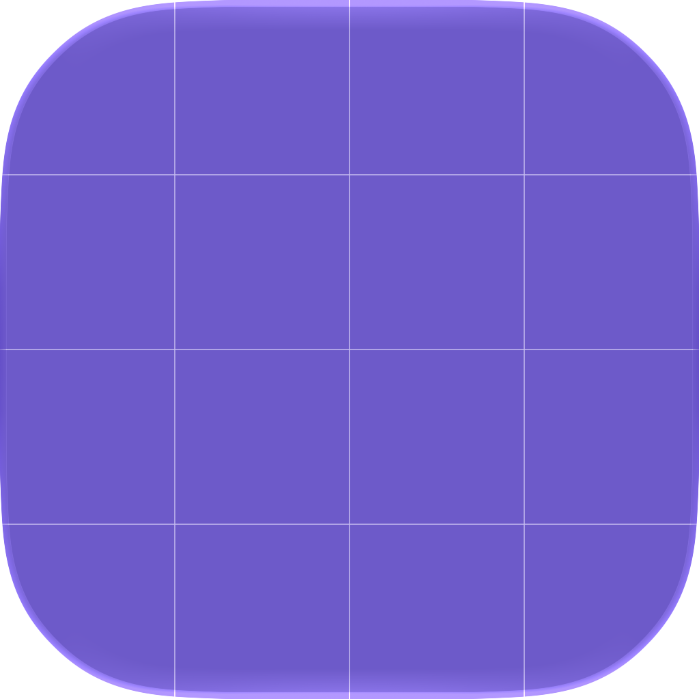

# TestFlight Button

Animated SVG buttons for TestFlight

### Blue

### Black

### White

## Icon Template

Editable Icon Composer templates for TestFlight builds.

### Full Grid

<table>
  <tr>
    <th>Default</th>
    <th>Dark</th>
    <th>Mono</th>
    <th>Tinted</th>
  </tr>
  <tr>
    <td></td>
    <td></td>
    <td></td>
    <td></td>
  </tr>
</table>

### Simplified Grid

<table>
  <tr>
    <th>Default</th>
    <th>Dark</th>
    <th>Mono</th>
    <th>Tinted</th>
  </tr>
  <tr>
    <td></td>
    <td></td>
    <td></td>
    <td></td>
  </tr>
</table>
